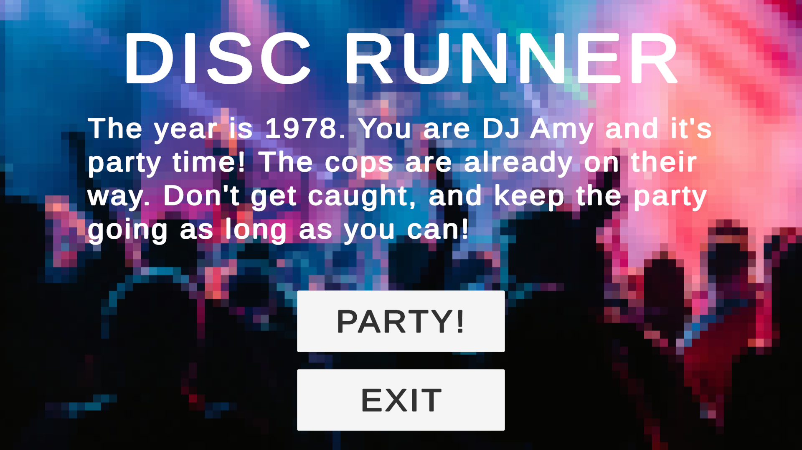
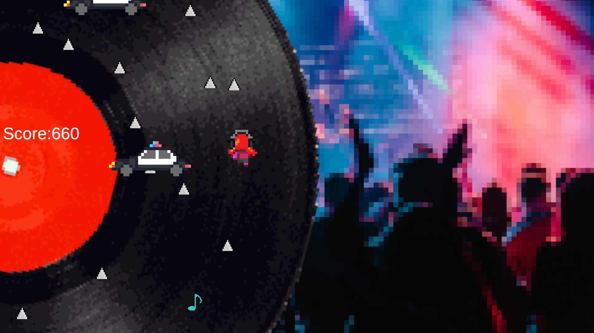
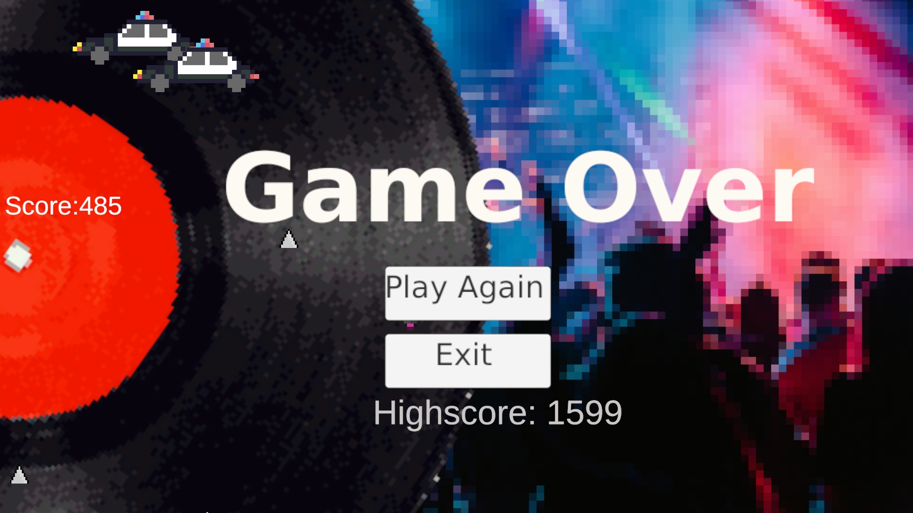

# Beschreibung
## Spielname 
Disc Runner

## Genre
Arcade

## Installationsanleitung
Über den folgenden Link kann man die Builds für Windows oder Linux herunterladen, und das Spiel dann über die entsprechenden ausführbaren Dateien starten.

Link zu den Builds: https://github.com/jstephani/DiscRunnerBuilds

## Systemanforderungen 
Betriebssystem: Windows (64-bit), oder Linux.

## Gameplay und Ziel  
Der/Die Spieler:in muss auf einer sich bewegenden Plattform Hindernissen ausweichen und Musiknoten einsammeln um einen Highscore aufzustellen.

Es gibt zwei Arten von Hindernissen:
Polizeiautos, die den Weg blockieren, und Spikes, die bei Berührung das Spiel sofort beenden.

## Schwindelgefahr
Längeres spielen kann aufgrund der konstanten Drehbewegung des Spielbereiches zu einem Schwindelgefühl führen.

## Screenshots
Start Screen:

Gameplay:

Game Over Screen:

## Aufgabenaufteilung

Colin: Code, Musik, Sprites.

Alex: Gameplay Idee.

Jeremy: Code, Sprites.

## Credits 
Chantal Lau: Inspiration für das Setting des Spiels.

Musik: enthält modifizierte Version des Songs “I Feel Love” von Donna Summer

### Sprites
Stachel: https://dinopixel.com/spike-sprite-pixel-art-25609

Musiknote: https://pixabay.com/de/illustrations/hinweis-musik-symbol-musiknote-7296802/

Polizeiauto: 	https://freesvg.org/pixel-art-police-car

Schallplatte: www.mediadig.de/leistungen/schallplatten-digitalisieren/

Party Hintergrundbild: https://unsplash.com/photos/woman-singing-on-stage-hTv8aaPziOQ

Spieler: Modifiziert von ursprünglichem Sprite von ElvGames.
